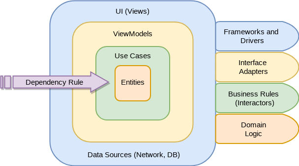
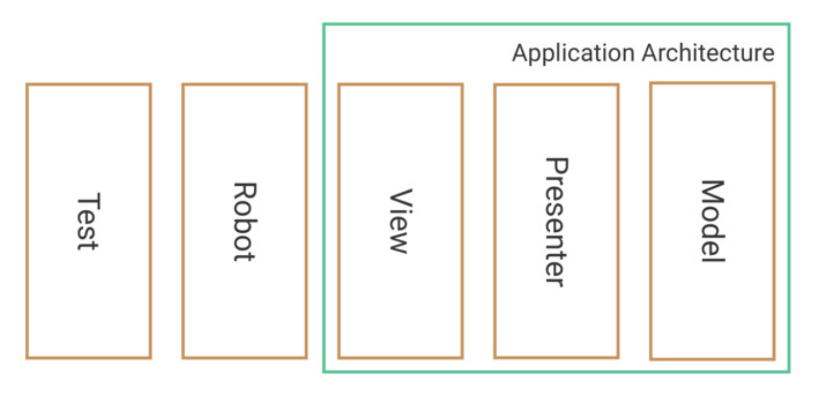

# SpaceX :rocket:

The purpose of this project is to follow up Clean Architecture principles by bringing them to Android. It is worth saying that the idea is to take advantage of the Kotlin Programming Language features plus also pull in lessons learned and ideas from other interesting aproaches like Functional Programming,
 `MVVM` setup, `Coroutines`, `Flow` and `LiveData` (I've kept a branch using `RxJava`). `DarkTheme` support is added too.

## Modules :department_store:
* **app** - The application module with access to **all the application**
* **data** - Android module that **can only access domain module**
* **data-api** - Android module that **can only access data module**
* **domain** - Kotlin module that **cannot access any other module**
* **presentation** - Android module that **can only access domain module**
* **navigation** - Android jetpack navigation abstraction (it contains the navigation config file) **cannot access any other module**

And two extra modules:
* **core** - Base classes module (factories, events, etc.) that **cannot access any other module**
* **core-android-test** - Tests classes module (rules, date builders,etc.) that **cannot access any other module**

## Testing :mag_right:

### Unit Testing

There are some highlights:
* Every layer in the architecture has been tested with its mapper|transformer|provider.
* Mockito has been used for mocking|stubbing.
* `Given|When|Then` steps have been followed, in order to give a more structured overview.

### UI Testing

Following the same approach I made in a previous personal project, a month ago [Medium Post][post], I've used a dynamic test configuration.
* In order to mock the responses and use them for instrumentation testing, I've used MockWebServer.
* In order to give a concise and clean face of the Espresso tests, I've applied [Robot Pattern][jake].

[post]:  https://medium.com/@f.prieto.moyano/mockwebserver-dagger2-with-style-b5367698ce13
[jake]:  https://academy.realm.io/posts/kau-jake-wharton-testing-robots/

## Demo :calling:

  

## Libraries Used :blue_book:

* [Coroutines][0] Library support for Kotlin coroutines.
* [Flows][1] for asynchronous data streams (still in experimental version).
* [LiveData][2] for reactive style programming (from VM to UI).
* [Navigation][3] for in-app navigation.
* [Dagger2][4] for dependency injection.
* [Retrofit][5] for REST api communication.
* [Timber][6] for logging.
* [Espresso][7] for UI tests.
* [Mockito-Kotlin][8] for mocking in tests.
* [MockWebServer][9] for Instrumentation tests.
* [AndroidX Test Library][10] for providing JUnit4 and functions as `launchActivity` in UI tests
* [Picasso][11] Image downloading and caching library
* [JodaTime][12] Date library that lets manage more extensively and easily dates
* [BottomSheet][13] Library that contains a bottom sheet view with animations (expand/collapse)
* [SolidAdapter][14] Library that provides a SolidAdapter implementation, instead of RecyclerView.Adapter

[0]:  https://github.com/Kotlin/kotlinx.coroutines
[1]:  https://kotlin.github.io/kotlinx.coroutines/kotlinx-coroutines-core/kotlinx.coroutines.flow/-flow/
[2]:  https://developer.android.com/topic/libraries/architecture/livedata
[3]:  https://developer.android.com/topic/libraries/architecture/navigation/
[4]:  https://github.com/google/dagger
[5]:  https://github.com/square/retrofit
[6]:  https://github.com/JakeWharton/timber
[7]:  https://developer.android.com/training/testing/espresso/
[8]:  https://github.com/nhaarman/mockito-kotlin
[9]:  https://github.com/square/okhttp/tree/master/mockwebserver
[10]: https://github.com/android/android-test
[11]: https://square.github.io/picasso/
[12]: https://github.com/JodaOrg/joda-time
[13]: https://github.com/qhutch/BottomSheetLayout
[14]: https://github.com/EranBoudjnah/solid

#  License

    Copyright 2019 Fernando Prieto Moyano

    Licensed under the Apache License, Version 2.0 (the "License");
    you may not use this file except in compliance with the License.
    You may obtain a copy of the License at

       http://www.apache.org/licenses/LICENSE-2.0

    Unless required by applicable law or agreed to in writing, software
    distributed under the License is distributed on an "AS IS" BASIS,
    WITHOUT WARRANTIES OR CONDITIONS OF ANY KIND, either express or implied.
    See the License for the specific language governing permissions and
    limitations under the License.