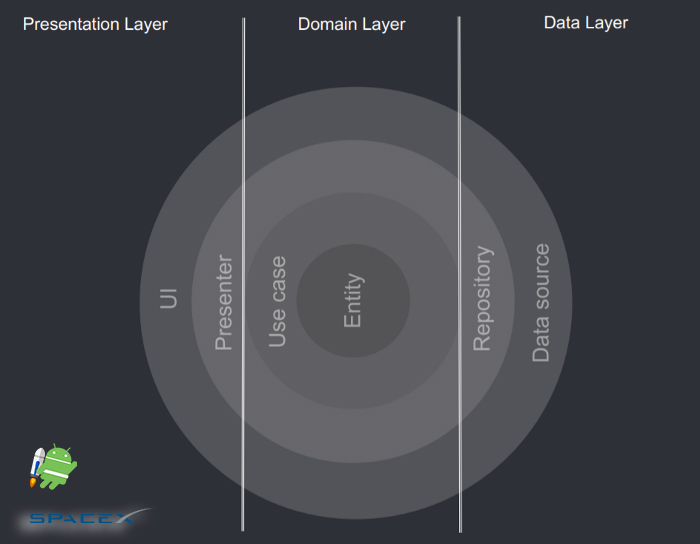

[]
[]

# SpaceX prepare for Clean Architecture liftoff:rocket:

## Table of Contents
- [Demo](#demo)
- [Introduction](#introduction)
- [Modules](#modules)
- [Testing](#testing)
- [Libraries Used](#libraries_used)
- [License](#license)

## Demo

  
  

## Introduction
The purpose of this project is to consolidate some of the learned insights throughout the years about the `Clean Architecture` principles and reflect those lesson on Android, taking advantage of the Kotlin programming language features too.
This project summarises some of the general use cases and needs that could be demanded on a production project using:`Jetpack Compose`, `Functional Programming`,`MVVM` setup, `Coroutines`, `Kotlin Flows` and `LiveData` (I've kept a branch using `RxJava` too).

## Modules
* **app** - The application module with access to **all the application**
* **data** - Android module that **can only access domain module**
* **data-api** - Android module that **can only access data module**
* **domain** - Kotlin module that **cannot access any other module**

And two extra modules:
* **core** - Base classes module (factories, events, etc.) that **cannot access any other module**
* **core-android-test** - Tests classes module (rules, date builders,etc.) that **cannot access any other module**

## Testing

### Unit Testing

There are some highlights:
* Every layer in the architecture has been tested with its mapper|transformer|provider.
* Mockito has been used for mocking|stubbing.
* `Given|When|Then` steps have been followed, in order to give a more structured overview.
* No comments in the tests because the tests functions are already concise and clear.

### UI Testing (Compose)

I opted to use two types of approaches:
- One using MockWebserver, where I recreate a real scenario where the app connects to an endpoint and I test the cases.
- Another one, that I consider `Isolated Compose Tests`, where it's possible to mock and set any content, UI state, etc. Which is to emulate very specific cases.

This section is still evolving.

## Libraries Used
* [Compose][0] for building native UI (declarative way using Kotlin).
* [Coroutines][1] Library support for Kotlin coroutines.
* [Flows][2] for asynchronous data streams.
* [Compose Navigation][3] for tabs navigation using Jetpack Compose.
* [Dagger Hilt][4] for dependency injection.
* [Retrofit][5] for REST api communication.
* [Timber][6] for logging.
* [Espresso][7] for UI tests.
* [Mockito-Kotlin][8] for mocking in tests.
* [MockWebServer][9] for Instrumentation tests.
* [Coil Compose][10] Image downloading and caching library supported by Jetpack Compose.
* [Lottie Compose][11] Library that provides a SolidAdapter implementation, instead of RecyclerView.Adapter
* [JodaTime][12] Date library that lets manage more extensively and easily dates

[0]:  https://developer.android.com/jetpack
[1]:  https://github.com/Kotlin/kotlinx.coroutines
[2]:  https://kotlin.github.io/kotlinx.coroutines/kotlinx-coroutines-core/kotlinx.coroutines.flow/-flow/
[3]:  https://developer.android.com/jetpack/compose/navigation
[4]:  https://dagger.dev/hilt/
[5]:  https://github.com/square/retrofit
[6]:  https://github.com/JakeWharton/timber
[7]:  https://developer.android.com/training/testing/espresso/
[8]:  https://github.com/nhaarman/mockito-kotlin
[9]:  https://github.com/square/okhttp/tree/master/mockwebserver
[10]: https://github.com/coil-kt/coil
[11]: https://airbnb.io/lottie/#/android-compose
[12]: https://github.com/JodaOrg/joda-time

## License
    Copyright 2021 Fernando Prieto Moyano

    Licensed under the Apache License, Version 2.0 (the "License");
    you may not use this file except in compliance with the License.
    You may obtain a copy of the License at

       http://www.apache.org/licenses/LICENSE-2.0

    Unless required by applicable law or agreed to in writing, software
    distributed under the License is distributed on an "AS IS" BASIS,
    WITHOUT WARRANTIES OR CONDITIONS OF ANY KIND, either express or implied.
    See the License for the specific language governing permissions and
    limitations under the License.